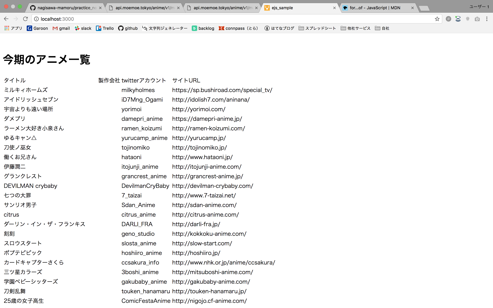

# お題１解答例
webapiで取得したデータをブラウザに表示する。

## ソースコード
* exercises1.js
```
var http = require('http');
var fs = require('fs');
var ejs = require('ejs');

var hostname = '127.0.0.1';
var port = 3000;
var server = http.createServer();
var url = 'http://api.moemoe.tokyo/anime/v1/master/2018/1';

server.on('request', function(req, res) {

    http.get(url, function(apires) {

        var body = '';
        apires.setEncoding('utf8');
    
        apires.on('data', function(chunk) {
            body += chunk;
        });
    
        apires.on('end', function() {

            var data = {};
            data.animes = JSON.parse(body);
            var template = fs.readFileSync('./exercises1.ejs', 'utf-8');
            var page = ejs.render(template, data);
            res.writeHead(200, {'Content-Type': 'text/html; charset=UTF-8'});
            res.write(page);
            res.end();
        });
    });
});

server.listen(port, hostname, function() {
    console.log(`Server runnning at http://${hostname}:${port}/`);
});
```

* exercises1.ejs
```
<html>
  <head>
    <title>ejs_sample</title>
    <style type="text/css">
      .div_block { width: 300px; display: inline-block;
                   margin: 5px; border: 1px solid #555; }
      .div_header { background-color: #CCC; padding: 10px; }
      img { object-fit: cover; width: 300px; height: 160px; }
      p { padding: 5px; }
    </style>
  </head>
  <body>
    <%# ヘッダー %>
  　<h1>今期のアニメ一覧</h1>
    <table>
      <tr>
          <td>タイトル</td>
          <td>製作会社</td>
          <td>twitterアカウント</td>
          <td>サイトURL</td>
      </tr>
      <%# アニメ数分ループ %>
      <% for (anime of animes) { %>
      <tr>
          <td><%= anime.title_short1 %></td>
          <td><%= anime.production %></td>
          <td><%= anime.twitter_account%></td>
          <td><%= anime.public_url %></td>
      </tr>
      <% } %>
    </table>
  </body>
</html>
```

## 起動方法
`node exercises1.js`

## 実行結果
```
$ node exercises1.js
Server runnning at http://127.0.0.1:3000/
```

* `http://localhost:3000` にアクセス
* ブラウザから確認



## プロセスの終了
* 'ctlr + z'