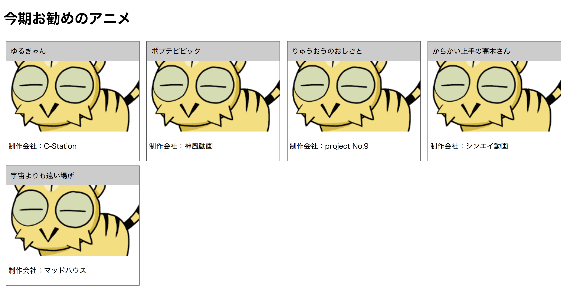

# EJSを使用したwebページの作成
サーバ側で保持しているアニメ情報を、テンプレートに埋め込みブラウザに表示します。

## 事前準備
ejsのパッケージをインストールします。

### インストール
```
$ npm install ejs
npm WARN bootstrap@4.0.0 requires a peer of jquery@1.9.1 - 3 but none is installed. You must install peer dependencies yourself.
npm WARN bootstrap@4.0.0 requires a peer of popper.js@^1.12.9 but none is installed. You must install peer dependencies yourself.
npm WARN sample@1.0.0 No description
npm WARN sample@1.0.0 No repository field.

+ ejs@2.5.7
updated 1 package in 1.51s


   ╭─────────────────────────────────────╮
   │                                     │
   │   Update available 5.5.1 → 5.6.0    │
   │     Run npm i -g npm to update      │
   │                                     │
   ╰─────────────────────────────────────╯
```

## ソースコード
* learn-ejs.js
```
var http = require('http');
var fs = require('fs');
 ejs = require('ejs');

const hostname = '127.0.0.1';
const port = 3000;
const server = http.createServer();

server.on('request', function(req, res) {

    // template.ejsをUTF8で読み込む
    var template = fs.readFileSync('./learn-template.ejs', 'utf-8');
    // templateに変数の値を埋め込む
    var page = ejs.render(template, data);

    res.writeHead(200, {'Content-Type': 'text/html; charset=UTF-8'});
    res.write(page);
    res.end();
});

server.listen(port, hostname, function() {
    console.log(`Server runnning at http://${hostname}:${port}/`);
});

var data = {
    header: '今期お勧めのアニメ',
    animes: [
        {
            title: 'ゆるきゃん',
            image: 'http://yurucamp.jp/images/ogp3.jpg',
            production: 'C-Station'
        },
        {
            title: 'ポプテピピック',
            image: 'http://hoshiiro.jp/ogp.png',
            production: '神風動画'
        },
        {
            title: 'りゅうおうのおしごと',
            image: 'http://ryuoh-anime.com/template/sns.jpg',
            production: 'project No.9'
        },
        {
            title: 'からかい上手の高木さん',
            image: 'http://takagi3.me/images/ogp2.jpg',
            production: 'シンエイ動画'
        },
        {
            title: '宇宙よりも遠い場所',
            image: 'http://yorimoi.com/images/top-main-v2.jpg',
            production: 'マッドハウス'
        }
    ]
};
```

* learn-template.ejs
```
<html>
  <head>
    <title>ejs_sample</title>
    <style type="text/css">
      .div_block { width: 300px; display: inline-block;
                   margin: 5px; border: 1px solid #555; }
      .div_header { background-color: #CCC; padding: 10px; }
      img { object-fit: cover; width: 300px; height: 160px; }
      p { padding: 5px; }
    </style>
  </head>
  <body>
    <%# ヘッダー %>
  　<h1><%= header %></h1>
    <%# アニメ数分ループ %>
    <% for (anime of animes) { %>
      <div class="div_block">
        <div class="div_header">
          <%= anime.title %>
        </div>
        " /> 
        <p>
          制作会社：<%= anime.production %>
        </p>
      </div>
    <% } %>
  </body>
</html>
```


## 起動方法
`node learn-ejs`

## 実行結果
```
$ node learn-ejs.js
Server runnning at http://127.0.0.1:3000/
```

* `http://localhost:3000` にアクセス
* ブラウザから確認


※ 表示される画像が異なる場合があります

## プロセスの終了
`ctlr + z`